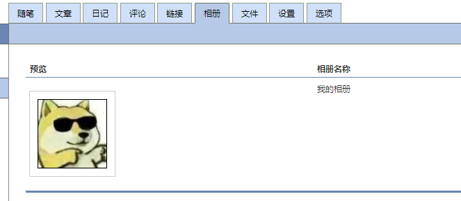
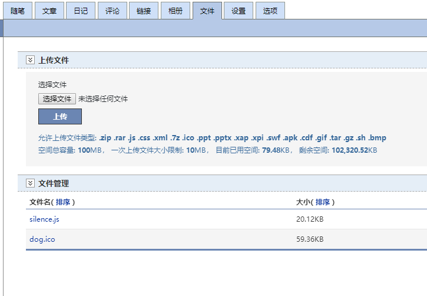
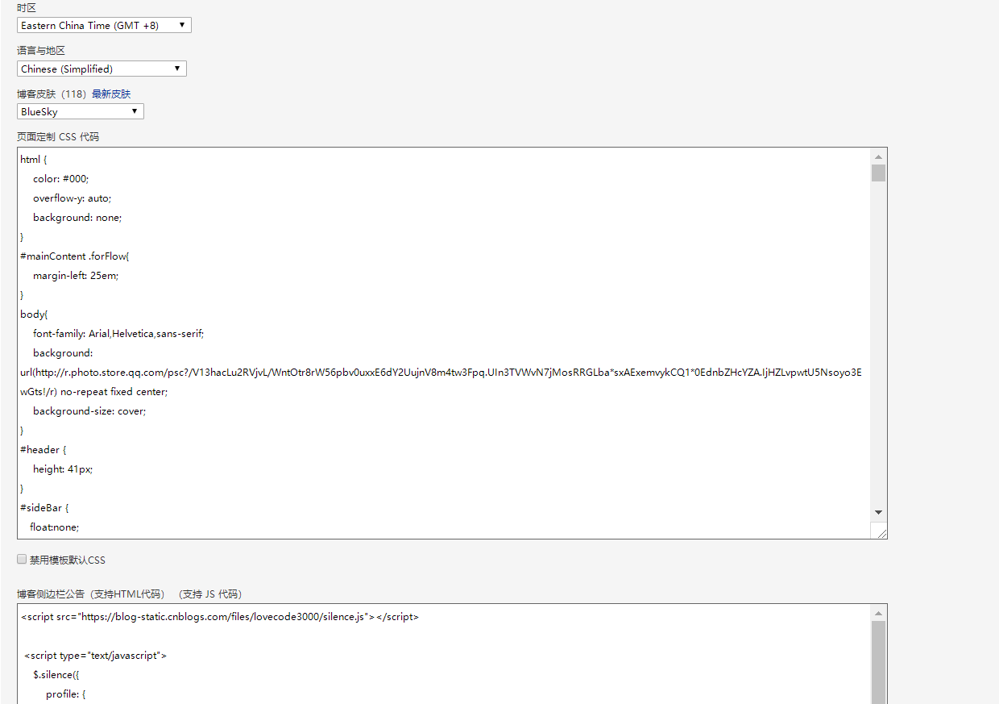

## 我的博客

> 这里是我的私人定制博客主题

设置步骤：
1. 上传自己的头像在相册中，并复制地址

2. 上传silence.js和ico图标进博客的文件中

3. 把主题设置为Bluesky主题
4. 把css代码复制粘贴进**页面定制 CSS 代码**中

5. 自定义设置，把它复制进**博客侧边栏公告（支持HTML代码）（支持 JS 代码）**
```javascript
//引入silence文件
<script src="https://blog-static.cnblogs.com/files/lovecode3000/silence.js"></script>

 <script type="text/javascript">
    $.silence({
        profile: {
            enable: true,
            //头像
            avatar: 'https://images.cnblogs.com/cnblogs_com/lovecode3000/1641988/o_200204133629head.jpg',
           //ico图标
            favicon: 'https://blog-static.cnblogs.com/files/lovecode3000/dog.ico',
        },
        catalog: {
            //博文目录
            enable: true,
            move: true,
            index: true,
            level1: 'h2',
            level2: 'h3',
            level3: 'h4',
        },
        reward: {
             //打赏二维码
            enable: true,
            title: '您的打赏是我最大的动力~',
            wechat: 'https://images.cnblogs.com/cnblogs_com/lovecode3000/1641988/t_200204133637pay.png?a=1580879306967',
            alipay: null
        }
    });
</script>
```
6. 保存查看


已知bug：  
反复滚动滚动条再返回页首，会出现header重复隐藏出现问题，  
解决方案应该是在jquery的header动画前面添加stop()，然后再设置动画，  
如$('#header').stop().slideDown()   

但该主题的header设置代码未找到，或本人愚昧没有找到更好的解决方法。  
已向原主题作者提出Issues。期待能有解决方案。

 [我的博客](https://www.cnblogs.com/lovecode3000/)  
 [原主题地址](https://github.com/esofar/cnblogs-theme-silence)  